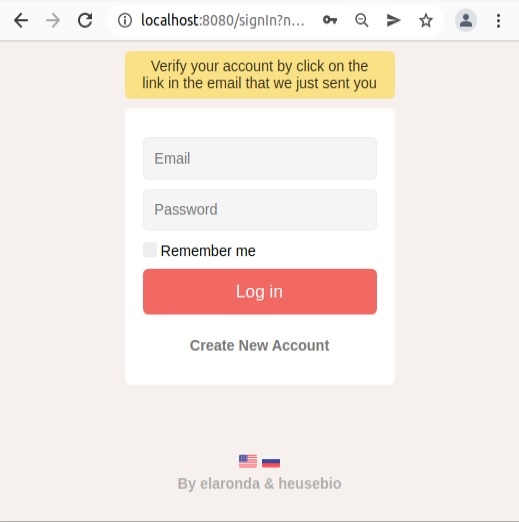

# spring-boot-42

## Task
____

We will create a truly "secure" service. 
Use Spring Security framework inside your Spring Boot application to implement role-based access to all pages:

| Role | URL                         |
|-----|-----------------------------|
|ADMIN| /admin/panel/halls          |
|ADMIN| /admin/panel/films          |
|ADMIN| /admin/panel/sessions       |
|ADMIN| /profile                    |
|Any authorized user| /session/search             |
|Any authorized user| /films/filmid/chat/messages |
|Any authorized user| /films/film-id/chat         |
|Any authorized user| /signIn, /signUp            |

In case an authorized user requests /signIn or /signUp page, they should be redirected to /profile page (/admin/panel/halls for administrator).
In case an unauthorized user requests a page other than /signIn or /signUp, they shall be redirected to the login page.
Repository layer in this task should be implemented using Spring Data JPA technology.
Below is an example of a JPA repository:

```java
public interface MessagesRepository extends JpaRepository<Message> {
    Optional<Message> findByText(String text);
    List<Message> findAllByAuthor(User author);
}
```

Additional requirements:
* Prepare implementations of standard Spring Security interfaces, UserDetails and UserDetailsService.
* /signIn page shall be prepared independently (use of built-in Spring Security page is prohibited).
* Implement "remember-me" functionality on /signIn page.
* Ensure protection against csrf attacks.
* User’s role shall be stored as an Enum value.

Multiple language support (in this tas, two languages of your choice) shall be implemented in your application.
A change of localization shall occur if a request with lang parameter was submitted for the requested page. Examples of how localization works are provided below:


Localization information shall be stored in browser cookies.
Therefore, when a page and/or application is reloaded, selected localization shall be preserved.
You shall provide localization support for at least any three pages.

Localization is closely related to data validation.
Each user shall be able to see a message about incorrectly filled form in the context of selected localization, 
for example:



In your exercise, you shall implement support for at least two languages and validate a registration form according to the following rules:
* First and last name fields shall be non-empty
* Email shall match the email recording format
* Phone number shall match +(code)digits pattern, e.g., +7(777)777777
* Password shall contain uppercase, lowercase letters, and at least one digit; field length shall be at least 8 characters.

Additional requirements:
* Provide properties files for localization and error messages.
* Provide .bin files - LocaleResolver, LocaleChangeInterceptor, LocalValidatorFactoryBean, MessageSource, MessageCodesResolver
* Use javax.validation.constraints.* annotations.
* Password validation shall be implemented using javax.validation.ConstraintValidator and @ValidPassword custom annotation. Example:

```java
@ValidPassword(message = "{errors.incorrect.password}")
private String password;
```

In this exercise, confirmation of a registered account using a link sent to a user’s email shall be implemented.

Thus, for User model, you need to add a field that indicates if an account is confirmed (CONFIRMED, NOT_CONFIRMED). 
Now, only verified users shall be able to access the application being developed. 
Administrator is verified by default.

Upon registration, a confirmation link in the following format shall be sent to a user’s email:

`http://{host:port}/confirm/{UUID}`

When clicking on the link, a user gets a page where they can log into their personal account by entering a username and a password.

Email submission shall be implemented using org.springframework.mail.javamail.JavaMailSender.

Note:
* To send an email, you need to use an existing mailbox, e.g., Gmail. SMTP settings for example@gmail.com mailbox with example password:

```properties
spring.mail.host=smtp.gmail.com
spring.mail.port=587
spring.mail.username=example@gmail.com
spring.mail.password=example
spring.mail.properties.mail.smtp.starttls.enable=true
spring.mail.properties.mail.smtp.allow8bitmime=true
spring.mail.properties.mail.smtp.ssl.trust=smtp.gmail.com
spring.mail.properties.mail.debug=true
```
